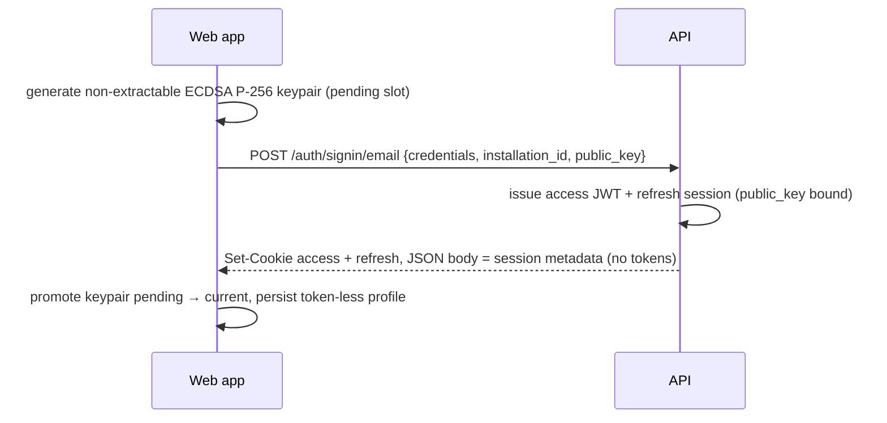
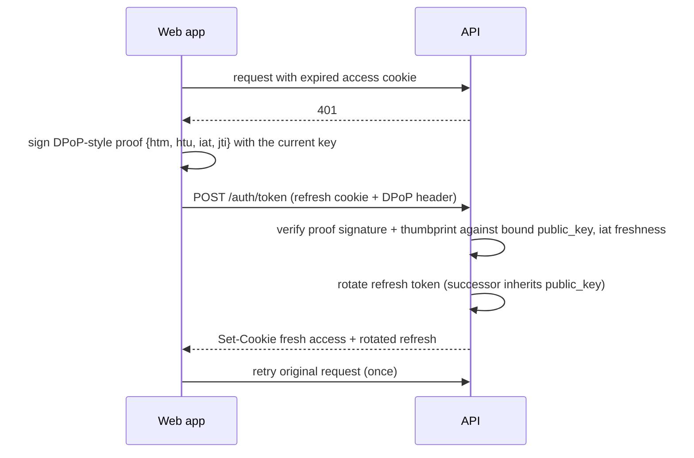

# Authentication

How the web app authenticates against the API and CouchDB, end to end.

## Overview & threat model

Access and refresh tokens live in **httpOnly cookies** set by the API. JavaScript — including any script injected through an XSS bug — can never read them, so a compromised page cannot exfiltrate a long-lived credential.

On top of that, the refresh token is **sender-constrained**: at sign-in the client generates a **non-extractable ECDSA P-256 keypair** (WebCrypto) and registers the public half with the server. Refreshing requires a proof signed by the private key, which the browser will sign with but never reveal. A stolen refresh cookie alone therefore cannot mint tokens, and deleting the key is a **fail-closed, offline-capable logout**: without it the session cannot outlive the current access token.

The web app and the API must share the **hostname** (ports may differ — cookies ignore ports, and same-host-different-port is same-site, which `SameSite=Lax` covers). Different hostnames for web and API are not supported.

## Cookies

| Cookie                | httpOnly | Path    | Purpose                                                                     |
| --------------------- | -------- | ------- | --------------------------------------------------------------------------- |
| `oboku_access_token`  | ✅        | `/`     | 5-minute access JWT; reaches every REST route and the `/couchdb` proxy      |
| `oboku_refresh_token` | ✅        | `/auth` | rotating refresh token; only sent to `/auth/token` and `/auth/logout`       |

Both are `SameSite=Lax`, host-only (no `Domain`), and `Secure` whenever the request came over https (direct or via `X-Forwarded-Proto`). The access token is a plain 5-minute bearer — no per-request crypto, so replication and the service worker are untouched. The refresh cookie's value changes on every refresh (rotation) and carries the refresh-token TTL as `Max-Age`.

## Sign in / sign up

All session-issuing routes (`signin/email`, `signin/google`, `magic-link/complete`) accept the optional `public_key` JWK and bind it to the refresh session (`refresh_tokens.public_key`). The keypair is staged under a *pending* slot and only promoted to *current* after the server has bound it, so a failed sign-in attempt never destroys the active session's key. The JSON body carries only session metadata (`dbName`, `email`, `nameHex`, and the freshly minted `sessionId`) — the tokens travel exclusively in `Set-Cookie` and never appear in a response body, so JS (and therefore XSS) cannot read them. The web app persists this token-less session and keeps the `sessionId` to revoke exactly this session at logout.

## Authenticated requests

The browser attaches `oboku_access_token` automatically ( `credentials: "include"` ):

* **REST**: the auth guard reads the cookie first and falls back to `Authorization: Bearer` (admin app).
* **CouchDB**: the `/couchdb` proxy translates the cookie into the `Authorization: Bearer` header CouchDB validates itself, keeps an already-present header untouched (admin), and strips cookies from what it forwards upstream.
* **Service worker**: inherits the cookie like any other client — the old auth message-passing between worker and main thread is gone. A background 401 simply propagates; the main thread refreshes on its own traffic.

CORS reflects only trusted origins (any port on the web hostname plus `API_CORS_TRUSTED_ORIGINS`) with credentials enabled, and a defense-in-depth middleware refuses cookie-authenticated mutations whose `Origin` is not trusted (CSRF; `SameSite=Lax` is the primary layer).

## Refresh

The refresh credential is the cookie, exclusively — no token in the URL or body. For a session with a bound `public_key`, `/auth/token` requires the `DPoP` header: a short JWT signed by the private key, verified with `jose` (signature by the embedded JWK, JWK thumbprint equal to the bound key, `htm = POST`, `iat` within a ±5-minute window; `htu` is deliberately not enforced because reverse proxies make the reconstructed URL unreliable). Concurrent 401s are collapsed into one in-flight refresh per client, and a request that 401s *after* someone else already refreshed is retried without triggering another refresh (refresh epoch).

Rotation semantics are unchanged: every refresh mints a successor (which inherits the bound key), the previous token stays valid through a one-hour grace window for lost responses and multi-tab races, and a replay past the grace window is refused without collapsing the chain.

## Logout

Fail-closed and offline-capable, in three steps (`useSignOut`):

1. **Delete the proof keys** from IndexedDB. From this instant nothing can refresh the session — even offline, it dies when the ≤5-minute access cookie expires.
2. **Clear local state** (query cache, active profile, plugin state). The UI is signed out immediately; the profile row stays as a `loggedOut` tombstone.
3. **Best-effort server revocation**: the tombstone sweep (`RevokeLoggedOutProfiles`, on boot / `online` / post-sign-out) calls `POST /auth/logout` with the tombstone's `sessionId` in the body — a non-secret identity, not the refresh cookie. The server revokes that whole Postgres chain by id and leaves the cookies untouched (there is no cookie-clearing path): they may already belong to a newer session, and the revoked rows make any lingering cookie inert. Only after the call succeeds does the sweep delete the local tombstone row. Offline sign-outs are retried until they succeed.

Revoking by `sessionId` is why the single cookie jar is not a problem: the sweep names the exact session to kill regardless of which refresh cookie is currently stored, so signing into another account — or the same one — before the sweep completes cannot misfire. A re-login mints a fresh `sessionId` on a new chain (after wiping the old one), so an old tombstone can never name the new session; it simply finds nothing to revoke.

## Refresh-session storage

Sessions live in Postgres (`refresh_tokens`): one row per issued token, hashed (SHA-256), chained per `(user_id, installation_id)`. Relevant columns:

* `token_hash` — the only lookup key.
* `public_key` — JSON-serialized public JWK bound to the session at sign-in (null for sessions issued before sender constraining shipped; those are rejected on their next refresh and must re-authenticate — no graceful migration).
* `superseded_at` / `successor_token` — rotation bookkeeping; the encrypted successor converges concurrent refreshes and is why the API must run as a **single instance**.

Individual tokens expire after ~6 months (`created_at` anchored); a daily cron deletes expired and long-superseded rows.

## Admin app & pre-cookie sessions

The admin app is a **separate surface** with its own endpoints under `/admin` (guarded by `AdminAuthGuard`, not the user cookie flow): `POST /admin/signin` and `POST /admin/refresh` return `access_token`/`refresh_token` in the JSON body and take `{ refresh_token }` in the body, and the admin app stores them in localStorage and sends `Authorization: Bearer`. The user guard's cookie-first read keeps that `Bearer` fallback for it. None of this touches the user `/auth/*` endpoints, which never put a token in a response body; in particular `/auth/logout` revokes by `session_id` and has no `refresh_token` body.

Pre-cookie web sessions are **not migrated**: after the cutover, the first authenticated request fails, and the user re-logs in once with all local data intact (same-account sign-in does not recreate the local database, and the sign-in wipes the old server chain). Tokens persisted by old bundles are dropped, not reused. A `loggedOut` tombstone written by a pre-`sessionId` bundle has no identity to revoke by, so the sweep cannot kill its chain from the client; that chain lapses through the refresh TTL and the stale-session cron instead (and it is rejected the moment it tries to refresh).

There is deliberately **no old-bundle back-compat**: `/auth/token` accepts no refresh token outside the cookie, so a browser still running a pre-cookie bundle cannot refresh once the new API is live. Those users are signed out until the PWA picks up the new bundle — which it does on the next visit — and then re-login once. The accepted trade-off is a short lockout instead of carrying token-in-URL transports.

Deploy the API and the web together (API first within the release): a new web bundle needs an API that sets cookies, and the old bundles' lockout window starts when the API ships.
